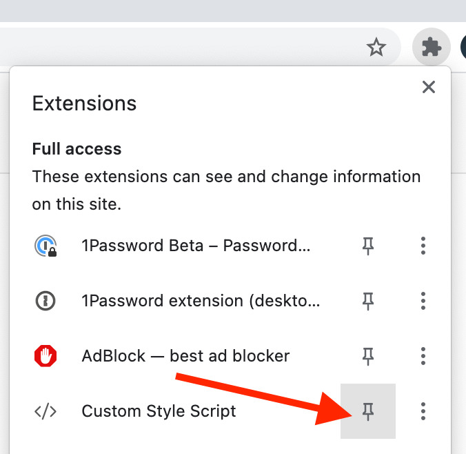
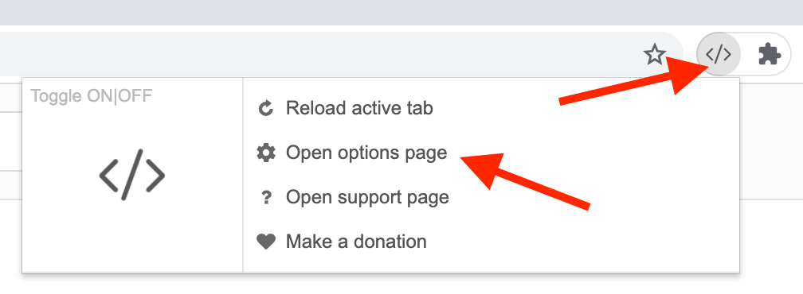
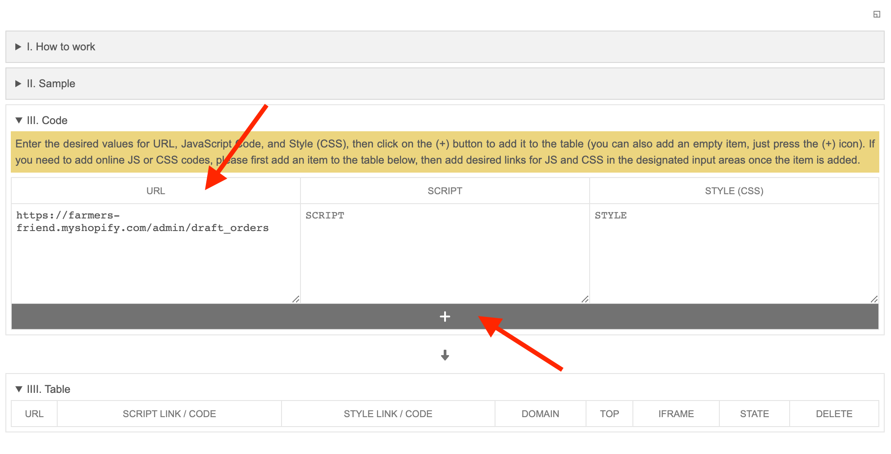
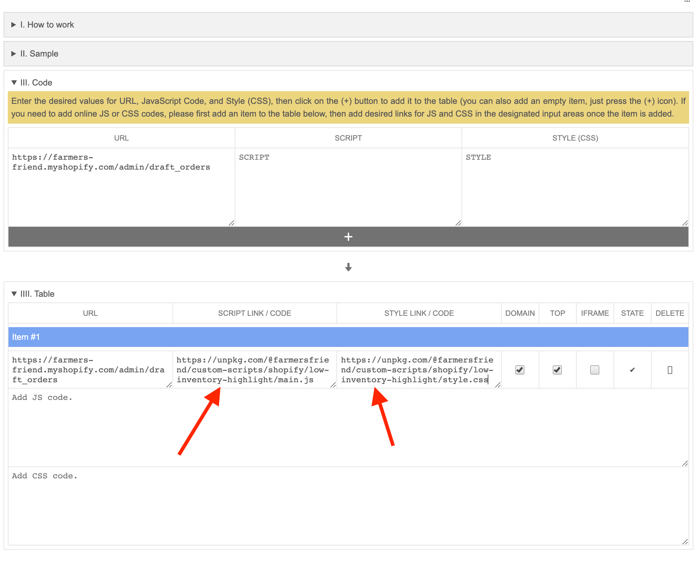
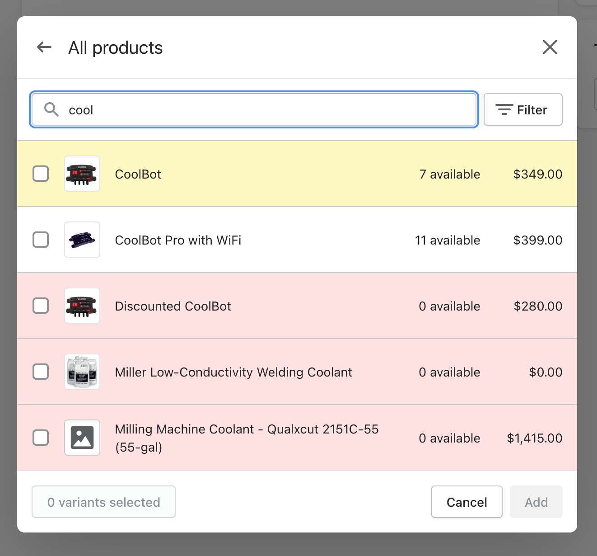

# Low Inventory Highlighting

This script will highlight items with low inventory in Shopify when creating a draft order.

## Installation
1. **Install the Custom Style Script** addon/extension for your browser:
   - Chrome: https://chrome.google.com/webstore/detail/custom-style-script/ecjfaoeopefafjpdgnfcjnhinpbldjij
   - Firefox: https://addons.mozilla.org/en-US/firefox/addon/custom-style-script/
2. **Pin** the extension _(optional)_
   
   

3. Tap on the plugin and the **Open options page**.
   
   

4. Add the URL to the **Code** section and then tap the **+** button.
   - **URL:** `https://farmers-friend.myshopify.com/admin/draft_orders`
   
      

5. Now add the script link and style link next to the URL in the Item #1 in the Table section.
   - **Script:** `https://unpkg.com/@farmersfriend/custom-scripts/shopify/low-inventory-highlight/main.js`
   - **Style (CSS):** `https://unpkg.com/@farmersfriend/custom-scripts/shopify/low-inventory-highlight/style.css`

      

Now products with a low inventory should be highlighted when they have a low inventory.

